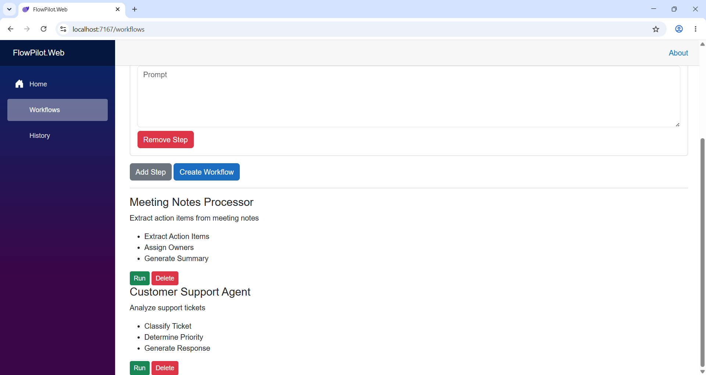
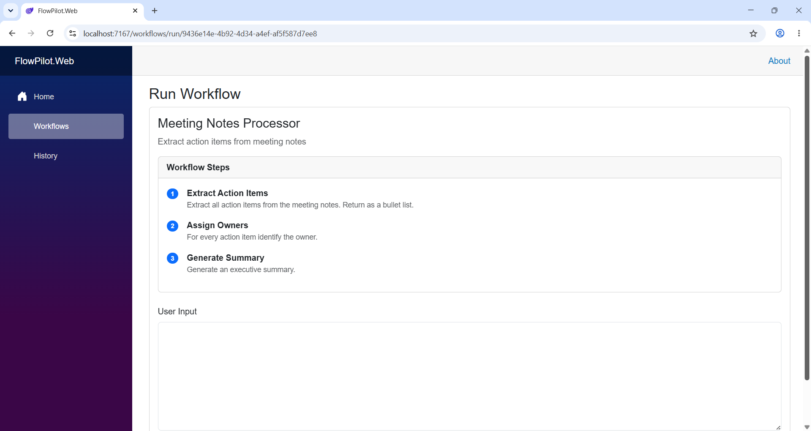
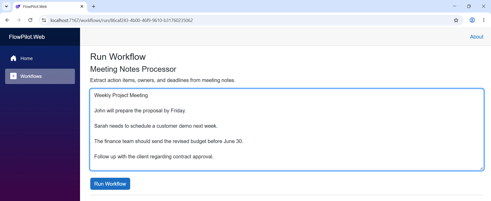
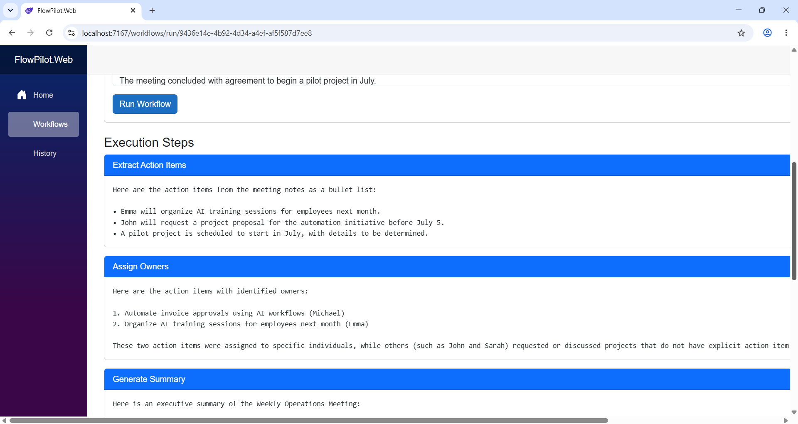
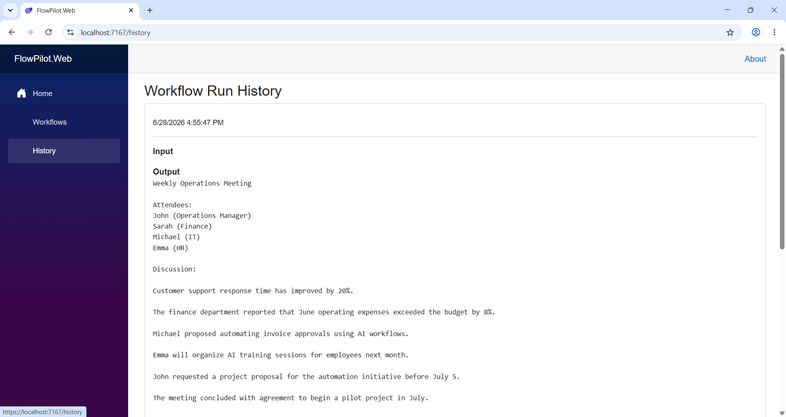

# FlowPilot AI

AI-powered workflow automation platform built with Blazor, FastAPI, and Ollama.

FlowPilot enables users to create AI workflows, execute AI agents, and automate business processes using prompt-driven automation.

---

## Features

### Workflow Management

* Create AI workflows
* Delete workflows
* Configure workflow prompts

### AI Workflow Execution

* Execute workflows directly from the UI
* Send user input to AI agents
* Generate structured AI responses

### AI Integration

* Local LLM execution using Ollama
* Prompt-driven workflow automation
* Extensible AI agent architecture

---

## Screenshots

### Workflow Management



### Create Multiple-Step Workflow


### Run Workflow



### User Input



### Workflow Execution



### Workflow History



---

## Example Workflow

### Meeting Notes Processor

Workflow Prompt:

```text
Extract all action items from the meeting notes.
Return a numbered list.
```

Input:

```text
Call customer tomorrow.
Prepare proposal.
Create invoice.
```

Output:

```text
1. Call customer tomorrow
2. Prepare proposal
3. Create invoice
```

---

## Architecture

```text
Blazor WebAssembly
        │
        ▼
FastAPI Backend
        │
        ▼
Workflow Engine
        │
        ▼
Ollama Agent
        │
        ▼
Local LLM (Llama 3.2)
```

---

## Technology Stack

### Frontend

* Blazor WebAssembly
* Bootstrap

### Backend

* FastAPI
* Python

### AI

* Ollama
* Llama 3.2

### Development Tools

* Visual Studio
* VS Code
* Git
* GitHub

---

## Current Capabilities

* Workflow CRUD
* Prompt Management
* Workflow Execution
* AI Agent Integration
* Local LLM Support
* Structured AI Output

---

## Roadmap

### Phase 1 — Core Platform

* [x] Workflow Management
* [x] AI Workflow Execution
* [x] Ollama Integration

### Phase 2 — Workflow Intelligence

* [x] Workflow Run History
* [x] Workflow Templates
* [x] Execution Logs
* [ ] Result Export

### Phase 3 — Advanced Automation

* [ ] Multi-Step Workflows
* [ ] Agent Chaining
* [ ] Human Approval Steps
* [ ] Scheduled Workflow Execution

---

## Local Development

### Backend

```bash
cd backend

python -m venv venv

venv\Scripts\activate

pip install -r requirements.txt

python -m uvicorn app.main:app --reload
```

### Frontend

```bash
cd frontend

dotnet run
```

---

## Project Goal

FlowPilot AI is a portfolio project focused on exploring AI-powered workflow automation using local large language models (LLMs). The long-term vision is to build a flexible platform capable of orchestrating business processes through configurable AI agents and workflows.
