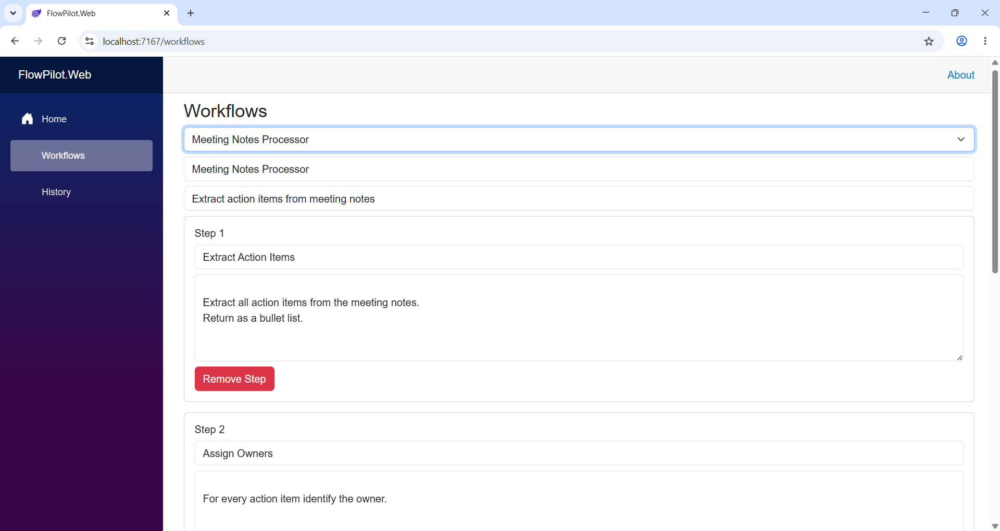

# FlowPilot AI

AI-powered workflow automation platform built with Blazor, FastAPI, and Ollama.

FlowPilot enables users to create AI workflows, execute AI agents, and automate business processes using prompt-driven automation.

---

## Features

### Workflow Management

* Create AI workflows
* Delete workflows
* Configure workflow prompts

### AI Workflow Execution

* Execute workflows directly from the UI
* Send user input to AI agents
* Generate structured AI responses

### AI Integration

* Local LLM execution using Ollama
* Prompt-driven workflow automation
* Extensible AI agent architecture

---

## Screenshots

### Workflow Management


### Create Multiple-Step Workflow



### Run Workflow


### User Input


### Workflow Execution


### Workflow History


---

## Example Workflow

### Meeting Notes Processor
Input:

```text
Sprint Planning Meeting
Date: June 26, 2026

Attendees:
- Alice (Project Manager)
- Bob (Backend Developer)
- Charlie (Frontend Developer)
- Diana (QA Engineer)

Discussion:

The team reviewed the progress of FlowPilot AI.

The workflow execution feature has been completed successfully.

The UI still needs improvement to support multi-step workflow visualization.

Bob will implement workflow history persistence using SQLite.

Charlie will redesign the Workflow Run page to display execution steps in a timeline.

Diana will prepare end-to-end test cases after the UI changes are completed.

The team agreed to release version 0.2 next Friday if all features pass testing.

Next meeting is scheduled for Tuesday at 10:00 AM.
```

---

## Architecture

```text
Blazor WebAssembly
        │
        ▼
FastAPI Backend
        │
        ▼
Workflow Engine
        │
        ▼
Ollama Agent
        │
        ▼
Local LLM (Llama 3.2)
```

---

## Technology Stack

### Frontend

* Blazor WebAssembly
* Bootstrap

### Backend

* FastAPI
* Python

### AI

* Ollama
* Llama 3.2

### Development Tools

* Visual Studio
* VS Code
* Git
* GitHub

---

## Current Capabilities

* Workflow CRUD
* Prompt Management
* Workflow Execution
* AI Agent Integration
* Local LLM Support
* Structured AI Output

---

## Roadmap

### Phase 1 — Core Platform

* [x] Workflow Management
* [x] AI Workflow Execution
* [x] Ollama Integration

### Phase 2 — Workflow Intelligence

* [x] Workflow Run History
* [x] Workflow Templates
* [x] Execution Logs
* [ ] Result Export

### Phase 3 — Advanced Automation

* [ ] Multi-Step Workflows
* [ ] Agent Chaining
* [ ] Human Approval Steps
* [ ] Scheduled Workflow Execution

---

## Local Development

### Backend

```bash
cd backend

python -m venv venv

venv\Scripts\activate

pip install -r requirements.txt

python -m uvicorn app.main:app --reload
```

### Frontend

```bash
cd frontend

dotnet run
```

---

## Project Goal

FlowPilot AI is a portfolio project focused on exploring AI-powered workflow automation using local large language models (LLMs). The long-term vision is to build a flexible platform capable of orchestrating business processes through configurable AI agents and workflows.
